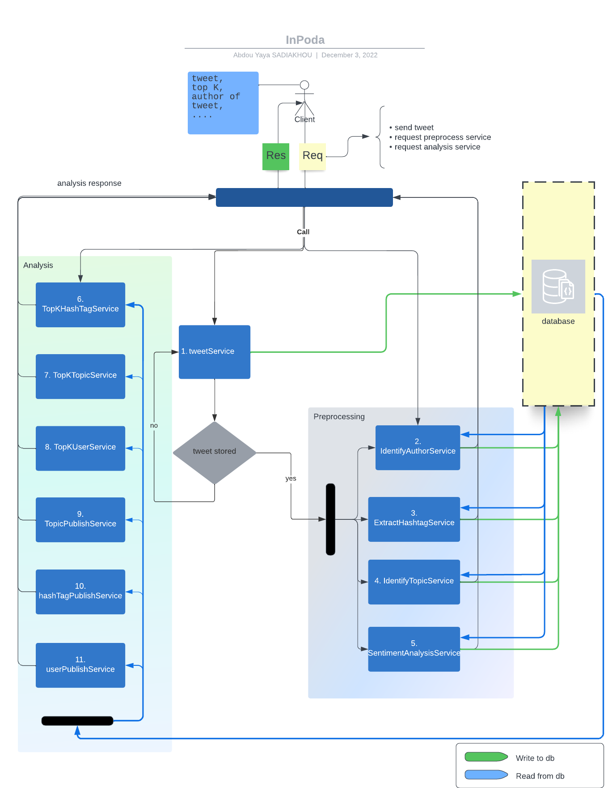

# WEB SERVICES SOAP

---

## INPODA

### Description

Un utilisateur fait un tweet sur le réseau social. Le tweet est publié à travers un service web SOAP qui va stocker la publication dans une table (Tweet) de la base de données.
La plateforme InPoDa que nous avons développé fournit un ensemble de fonctionnalités que nous avons par ailleurs considéré comme des services à part entière afin de découpler le code le maximum possible.
Entre autre pour un tweet donné on peut:
> Identifier l’auteur du tweet (ServiceIdentificationAuteur)

> Extraire les différents hashtag (ServiceHashtagExtraction)

> Prédire le sentiment dégagé par le tweet (ServiceSentimentAnalysis)

> Identifier les topics du tweet (ServiceIdentificationTopic)

A cela s'ajoutent les services d’**analyse de données** sur la base de données entière.

>> Afficher le top K des hashtags (ServiceTopKHashtag), 

>>Le top K des utilisateurs (ServiceTopKUsers)

>> Le top K des topics (ServiceTopKTopics)

>>Le nombre de publications par utilisateur (ServiceUserPublish),

>>Le nombre de publications par hashtag (ServiceHashtagPublish)

>>Le nombre de publication par topic (ServiceTopicPublish)

---

### Architecture du système

